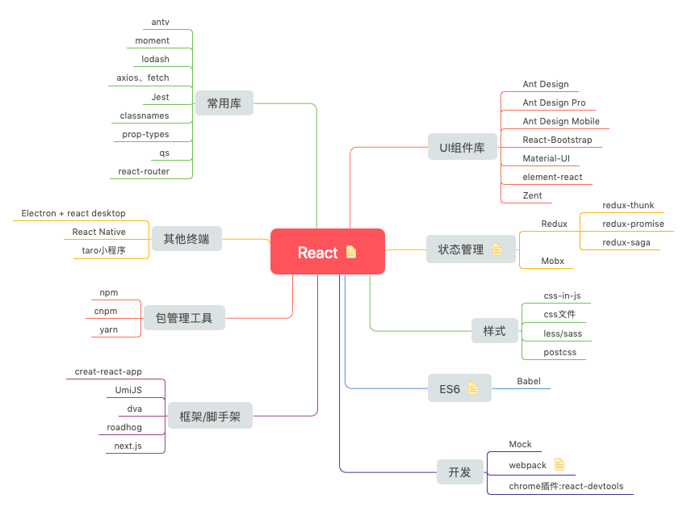
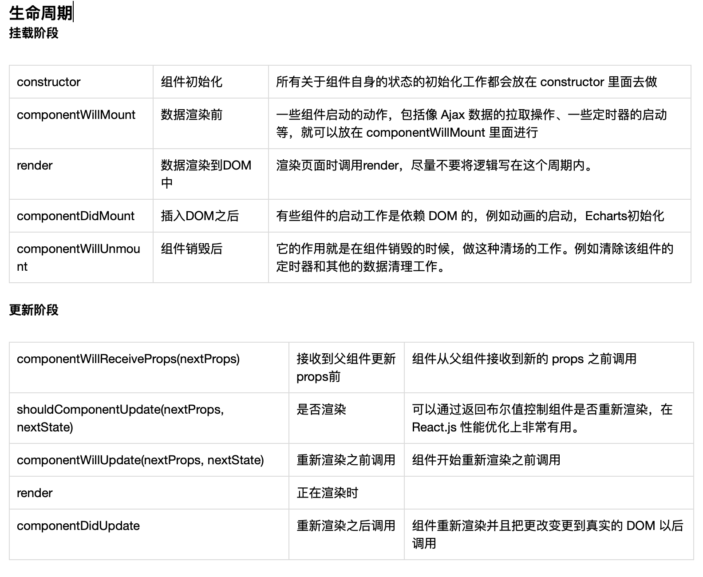

[toc]

update：见[README-v2.md](./README-v2.md)
---
# Hello React

## 项目说明
本项目主要梳理 react 相关的知识，即可作为 react 的入门手册，也可作为 react 的最佳实践手册。主要内容有：

#### react 生态
目的让大家了解 react 相关的技术选型，选择更适合的架构，详见[思维导图](./assets/React全家桶.png)

#### dva 的组成
使用一个 [todoList](./todoList/README.md) 例子讲解从 *javascript -> react -> redux -> redux-saga -> dva* 的发展历程。目的是让大家能够在使用 dva 的时候了解其中的概念由来，更快的定位问题与解决问题。

#### 最佳实践
- 各库之间如何选择？
- 坑
- 各项目所遇到的问题
- 下一个项目

## 项目计划
* [x] 各库之间如何选择？
* [x] 什么是 Flux？
* [x] 实现一个react、redux、redux+react-saga的todoList
* [x] 列表要加 key
* [x] redux-saga
* [ ] antd-design-pro有哪些值得学习的地方？
* [ ] 修改javascript、react版本的todoList，加注释，更利于阅读
* [x] 课程大纲
* [ ] 使用 refs 与 state 管理 from 有什么利弊吗？

---

## React 生态


---

## React
用于构建用户界面的 JavaScript 库
#### 产生原因
> 随着 JavaScript 单页应用开发日趋复杂，JavaScript 需要管理比任何时候都要多的 state （状态）。
> 管理不断变化的 state 非常困难。如果一个 model 的变化会引起另一个 model 变化，那么当 view 变化时，就可能引起对应 model 以及另一个 model 的变化，依次地，可能会引起另一个 view 的变化。直至你搞不清楚到底发生了什么。
> 
> from [redux文档-动机](https://www.redux.org.cn/docs/introduction/Motivation.html)

#### 特性简介

* JSX：构建DOM结构
* 虚拟DOM：局部更新
* 只涉及UI层：data => view
* 组件：父子组件的传递
* 生命周期
* 数据流动：单向数据流，自顶向下

#### 组件生命周期


#### 数据流动
数据流自顶向下


组件间共享状态


更多的组件


todoList的组件组织与数据流向图


## Flux & Redux
Flux 是一种模式，基于这种模式有很多实现，redux 是其中一种。

> “Flux”的概念很简单，view 层触发了一个事件（比如说，用户在文本域中输入了一个姓名），这个事件更新了 model，然后 model 触发了一个事件，view 响应了 model 的事件，使用最新的数据进行渲染。就这样。
> 
>  from [ReactJS 傻瓜教程](https://qianduan.group/posts/59977ed0b963854f926adcc1)


redux 数据流


redux 的核心思想是state 的变化变得可预测。

todoList的组件组织与数据流向图


## redux-saga
redux 只处理可预测的变化，而对于不可预测（定时器、异步函数、数据请求等）的变化，redux无能为力。

社区有三种方案，使用人数最多的是 redux-saga。

reudx-saga 的原理是拦截异步 action，执行异步函数，成功后回调同步 action。


## dva
- 开发环境与打包依赖 umi
- 封装了 react, redux, redux-saga 处理数据的库，并对外提供接口
- 封装了 react-router, fetch 等实用库
- ...

更多内容请参考[dva的包依赖](https://github.com/dvajs/dva/blob/master/package.json)

---
# 最佳实践
## 各库之间如何选择？
原则：新库(API、框架、工具等)的出现是为了解决已有问题，但新东西带来了更多的学习成本。我们要做的是**在已有问题与使用成本之间找到一个平衡点**。

考虑的因素
- 学习成本(是否会节省时间)
- 可能会遇到的问题
- 文档是否齐全
- 趋势（[可参考](https://mp.weixin.qq.com/s/d_ORZMYZEglaYpukeSucDg)）
- github start 数量
- 更新频率
- ...


## 坑
#### node_modules 层级目录太深导致 WebStorm 崩溃？
[webstorm忽略node_modules目录](https://www.cnblogs.com/chengwb/p/6183440.html)

#### node_modules 中依赖包报错？
1、有可能是各组件版本之间不支持导致，例如使用最新的 webpack 配合较老的 webpack-dev-server
2、有可能是下载包依赖时文件错误。（[曾经遇到过手机分享网络下载的包一直报错的情况](https://segmentfault.com/q/1010000016591545)）
解决办法：更换网络或者尝试 yarn

#### this.setState({}) 是异步更新的
```javascript
import React from 'react'

class App extends React.Component {
    constructor(props) {
        super(props)
        this.state = {
            id: null
        }
    }
    getList = (userName) => {
        // request...
    }
    // 因为setState 是异步的，会造成不可预期的结果
    badFilter = (userName) => {
        this.setState({
            userName: userName
        })
        this.getList(this.state.userName)
    }
    // 理论上 setState 参数设置为函数会立即更新
    // 这样会影响性能，且实际情况是仍不可控
    goodFilter = (userName) => {
        this.setState(() => {
            return {
                userName: userName
            }
        })
        this.getList(this.state.userName)
    }
    // 最好的方式是不要在 setState 后依赖 state
    bestFilter = (userName) => {
        this.setState({
            userName: userName
        })
        this.getList(userName)
    }
    render() {
        return (
            <div>
                {this.state.id}
                <button onClick={() => this.bestFilter('zhangsan')}>filter</button>
            </div>
        )
    }
}
export default App
```

#### 不要试图手动更改 state 里的状态，会造成不可预期的结果

```javascript
import React from 'react'

class App extends React.Component {
    constructor(props) {
        super(props)
        this.state = [1, 2, 3, 4, 5, 6]
    }
    // 手动更改 state 里的状态，会造成不可预期的结果
    badPush = () => {
        let _thisState = this.state
        _thisState.push(8)// 注意这里更改了 this.state
        this.setState(_thisState)
    }
    // 更改状态只能用 setState
    goodPush = () => {
        this.setState([
            ...this.state,
            8,
        ])
    }
    render() {
        return (
            <div>
                {this.state}
                <button onClick={this.goodPush}>push 8</button>
            </div>
        )
    }
}
export default App
```
#### 列表要加 key

Keys应该是稳定的，可预测的，且唯一的。

> Keys可以在DOM中的某些元素被增加或删除的时候帮助React识别哪些元素发生了变化。因此你应当给数组中的每一个元素赋予一个确定的标识。
> 
> from [react 文档](https://react.docschina.org/docs/lists-and-keys.html#keys)

更多内容参考[协调（Reconciliation）](https://react.docschina.org/docs/reconciliation.html)

#### webpack
不熟悉 webpack 的配置时，最好不要从零开始使用 webpack 工具搭建项目。
理由：
- webpack 更新特别快，3.x 和 4.x 版本差异较大
- 耗费大量时间
- 有很多坑

## 各项目所遇到的问题
#### 模块全生命周期
- [ ] webpack 没配置好导致打包文件为10M
- [x] react 结合 echarts 传递参数非常困难

#### 权限中心 & Spendqd
- [x] 一个组件三个人都实现了一遍
- [x] 交互逻辑不一致导致出现"BUG"
- [x] 函数(变量)命名方式不一致
- [x] 命名方式与业务逻辑耦合导致快速开发受阻（见下例）
- [x] 没有更好的区分纯组件、业务逻辑组件（[容器组件和展示组件](https://www.redux.org.cn/docs/basics/UsageWithReact.html)）
- [ ] 路由跳转不能自动清除表单
- [ ] 没有公共方法能够改变各 module 里的 state（每个module都要写 changeKeyValue 方法）
- [ ] 从 view => models => server，每一步都要传递接收参数，很麻烦

```javascript
// 命名方式与业务逻辑耦合导致快速开发受阻

// bad
// 用户列表
const userList = [
    '张飞',
    '关羽',
    '刘备',
]

// good
const list = [
    '张飞',
    '关羽',
    '刘备',
]
```

#### datamart
- 使用jQuery操作DOM
- 没有模块化，一个文件3000多行导致难以更新迭代
- 使用 react-scripts(creat-react-app) 搭建开发环境导致不可配置且特别慢

#### Antd Design Pro & 海信项目
好的地方
- webpackrc.js 配置@操作符，指向/src目录，以后写相对于src的路径，不用../../../，只用 @/pages/golbel.js
- 业务逻辑 models 写在 /src/pages/page/models 中，共用 models 写在 /src/models/globle.js 中
- 


## 下一个项目
#### 应该遵守的规则
- 约定大于配置
    - 多人协作时分配共用组件，避免重复开发
    - 交互逻辑要一致
- 多写纯组件（容器组件），一次开发，随处可用
- 对数据请求进行封装

纯组件：不涉及 state，可移植到别的项目，放在 /component
业务逻辑组件：涉及 state，与业务耦合，放在 /containers
路由组件：与路由相关，放在 /pages


#### 有争议的方案：
- 我们需不需要action creator？（[可参考](https://www.zhihu.com/question/62690658)）
- 我们需不需要prop-types？
- 需不需要统一代码风格？统一为什么风格？（eslint、Airbnb）


## 参考资料

- [Element React 版发布啦！](https://zhuanlan.zhihu.com/p/26818433)
- [4 张动图解释为什么（什么时候）使用 Redux](https://segmentfault.com/a/1190000012142449)
- [stateofjs](https://2018.stateofjs.com/)
- [精读前后端渲染之争](https://github.com/camsong/blog/issues/8)
- [库，框架，架构，平台，有什么明确的区别？](https://www.zhihu.com/question/29643471)
- [Jquery ajax, Axios, Fetch区别之我见](https://segmentfault.com/a/1190000012836882)
- [fetch 没有你想象的那么美](http://undefinedblog.com/window-fetch-is-not-as-good-as-you-imagined/?utm_source=caibaojian.com)
- [在 2016 年学 JavaScript 是一种什么样的体验？](https://zhuanlan.zhihu.com/p/22782487)
- [展示性组件和容器组件](https://www.zcfy.cc/article/presentational-and-container-components)
- [simplest-redux-example](https://github.com/jackielii/simplest-redux-example)
- [在Redux中，应该把逻辑放在action creator里，还是分散在reducer里？](https://www.zhihu.com/question/62690658)
