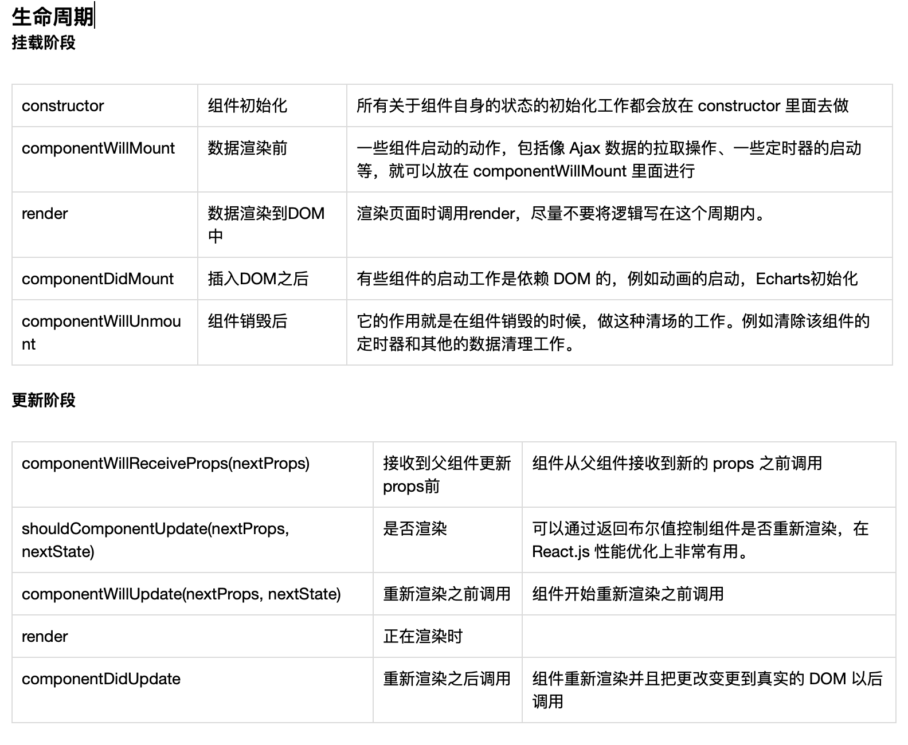

[toc]
# Hello React

todo
* [x] 各库之间如何选择？
* [x] [图解 Flux](https://qianduan.group/posts/59977ed0b963854f926adcda)
* [x] 什么是 Flux？
* [ ] 脚手架之间的关系
* [ ] 最佳实现：模块化、ES6语法、海信项目的长处

* [ ] 实现一个react、redux、redux+react-saga的todoList
* [ ] [在Redux中，应该把逻辑放在action creator里，还是分散在reducer里？](https://www.zhihu.com/question/62690658)

---

## React 生态


## React
用于构建用户界面的 JavaScript 库
#### 产生原因
> 随着 JavaScript 单页应用开发日趋复杂，JavaScript 需要管理比任何时候都要多的 state （状态）。
> 管理不断变化的 state 非常困难。如果一个 model 的变化会引起另一个 model 变化，那么当 view 变化时，就可能引起对应 model 以及另一个 model 的变化，依次地，可能会引起另一个 view 的变化。直至你搞不清楚到底发生了什么。
> 
> from [redux文档-动机](https://www.redux.org.cn/docs/introduction/Motivation.html)

#### 特性简介

* 虚拟DOM
* 只涉及UI层：data => view
* JSX：构建DOM结构
* 组件：父子组件的传递
* 生命周期
* 数据流动：单向数据流，自顶向下

#### 组件生命周期



#### 数据流动
数据流自顶向下

组件间共享状态

更多的组件


## Flux & Redux
Flux 是一种模式，基于这种模式有很多实现，redux 是其中一种。

> “Flux”的概念很简单，view 层触发了一个事件（比如说，用户在文本域中输入了一个姓名），这个事件更新了 model，然后 model 触发了一个事件，view 响应了 model 的事件，使用最新的数据进行渲染。就这样。
> 
>  from [ReactJS 傻瓜教程](https://qianduan.group/posts/59977ed0b963854f926adcc1)


redux 数据流


## 各库之间如何选择？
原则：新库(API、框架、工具等)的出现是为了解决已有问题，但新东西带来了更多的学习成本（或更多的问题）。**在已有问题与使用成本之间找到一个平衡点**。

考虑的因素
- 学习成本(是否会节省时间)
- 文档是否齐全
- 社区关注度
- github start 数量（即用户使用率，[可参考](https://mp.weixin.qq.com/s/d_ORZMYZEglaYpukeSucDg)）
- 更新频率
- ...


## 坑
#### node_modules 层级目录太深导致 WebStorm 崩溃？
[webstorm忽略node_modules目录](https://www.cnblogs.com/chengwb/p/6183440.html)

#### node_modules 中依赖包报错？
1、有可能是各组件版本之间不支持导致，例如使用最新的 webpack 配合较老的 webpack-dev-server
2、有可能是下载包依赖时文件错误。（[曾经遇到过手机分享网络下载的包一直报错的情况](https://segmentfault.com/q/1010000016591545)）
解决办法：更换网络或者尝试 yarn

#### this.setState({}) 是异步更新的
```javascript
import React from 'react'

class App extends React.Component {
    constructor(props) {
        super(props)
        this.state = {
            id: null
        }
    }
    getList = (userName) => {
        // request...
    }
    // 因为setState 是异步的，会造成不可预期的结果
    badFilter = (userName) => {
        this.setState({
            userName: userName
        })
        this.getList(this.state.userName)
    }
    // 理论上 setState 参数设置为函数会立即更新
    // 这样会影响性能，且实际情况是仍不可控
    goodFilter = (userName) => {
        this.setState(() => {
            return {
                userName: userName
            }
        })
        this.getList(this.state.userName)
    }
    // 最好的方式是不要在 setState 后依赖 state
    bestFilter = (userName) => {
        this.setState({
            userName: userName
        })
        this.getList(userName)
    }
    render() {
        return (
            <div>
                {this.state.id}
                <button onClick={() => this.bestFilter('zhangsan')}>filter</button>
            </div>
        )
    }
}
export default App
```

#### 不要试图手动更改 state 里的状态，会造成不可预期的结果

```javascript
import React from 'react'

class App extends React.Component {
    constructor(props) {
        super(props)
        this.state = [1, 2, 3, 4, 5, 6]
    }
    // 手动更改 state 里的状态，会造成不可预期的结果
    badPush = () => {
        let _thisState = this.state
        _thisState.push(8)// 注意这里更改了 this.state
        this.setState(_thisState)
    }
    // 更改状态只能用 setState
    goodPush = () => {
        this.setState([
            ...this.state,
            8,
        ])
    }
    render() {
        return (
            <div>
                {this.state}
                <button onClick={this.goodPush}>push 8</button>
            </div>
        )
    }
}
export default App
```

#### webpack
最好不要从零开始使用 webpack 工具搭建项目

## 最佳实现
#### 各项目所遇到的问题
**1、模块全生命周期**
- webpack 没配置好导致打包文件10M
- react 结合 echarts 传递参数非常困难

**2、权限中心 & Spendqd**
- 一个组件三个人都实现了一遍，而且交互逻辑不一致
- 交互逻辑不一致导致出现"BUG"
- 函数(变量)命名方式不一致
- 命名方式与业务逻辑耦合
- 没有更好的区分纯组件、业务逻辑组件
- 路由跳转不能清除表单

		
|  | 展示组件 | 容器组件 |
| --- | --- | --- |
| **作用** | 描述如何展现（骨架、样式） | 描述如何运行（数据获取、状态更新） |
| **直接使用 Redux** | 否 | 是 |
| **数据来源** | props | 监听 Redux state |
| **数据修改** | 从 props 调用回调函数 | 向 Redux 派发 actions |
| **调用方式** | 手动 | 通常由 React Redux 生成 |
form [容器组件和展示组件](https://www.redux.org.cn/docs/basics/UsageWithReact.html)

纯组件：不涉及 state，可移植到别的项目，放在 /component
业务逻辑组件：涉及 state，与业务耦合，放在 /containers
路由组件：与路由相关，放在 /pages

```javascript
// bad

// 用户列表
const userList = [
    '张飞',
    '关羽',
    '刘备',
]
```
```javascript
// good

const list = [
    '张飞',
    '关羽',
    '刘备',
]
```

**3、1169数据超市**
- 使用jQuery操作DOM
- 没有模块化
- 使用 react-scripts(creat-react-app) 搭建开发环境导致特别慢

**4、海信门户**
#### 以后的项目
- 多人协作时前期有人单独写通用组件
- 开发过程中写的组件


## 参考资料

- [Element React 版发布啦！](https://zhuanlan.zhihu.com/p/26818433)
- [4 张动图解释为什么（什么时候）使用 Redux](https://segmentfault.com/a/1190000012142449)
- [stateofjs](https://2018.stateofjs.com/)
- [精读前后端渲染之争](https://github.com/camsong/blog/issues/8)
- [库，框架，架构，平台，有什么明确的区别？](https://www.zhihu.com/question/29643471)
- [Jquery ajax, Axios, Fetch区别之我见](https://segmentfault.com/a/1190000012836882)
- [fetch 没有你想象的那么美](http://undefinedblog.com/window-fetch-is-not-as-good-as-you-imagined/?utm_source=caibaojian.com)
- [在 2016 年学 JavaScript 是一种什么样的体验？](https://zhuanlan.zhihu.com/p/22782487)
- [展示性组件和容器组件](https://www.zcfy.cc/article/presentational-and-container-components)
- [simplest-redux-example](https://github.com/jackielii/simplest-redux-example)
